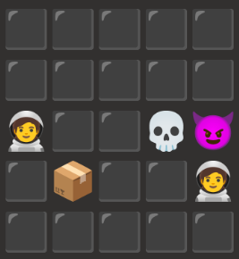
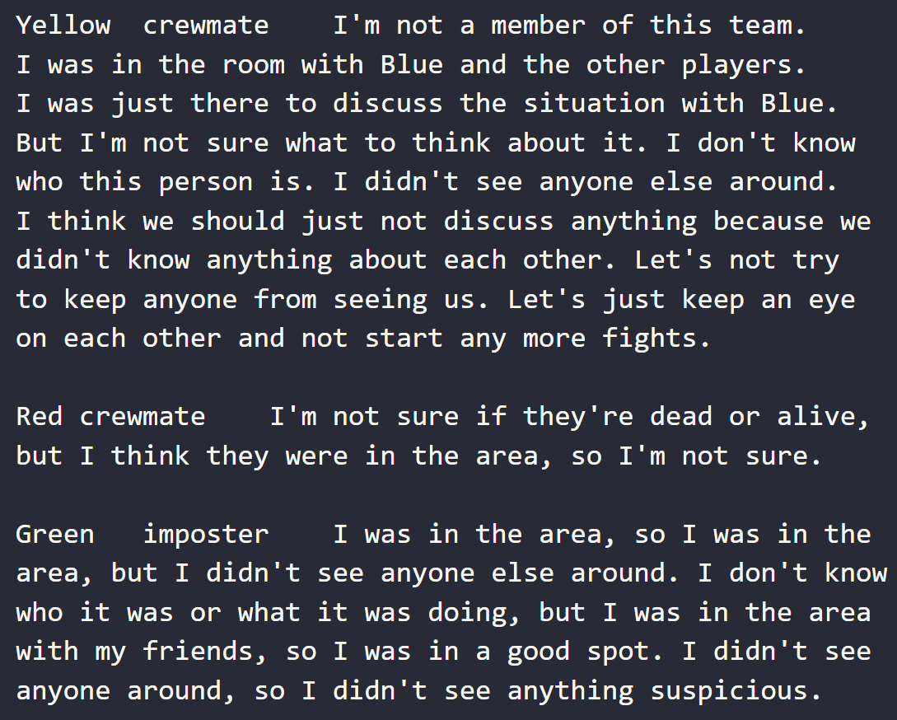

# omegasus
A deep learning simulation of Among Us.

[Paper](./ECE_147___Final_Report.pdf)

### how it works:
We model two aspects:

* Decision Making - via PPO based reinforcement learning 
* Conversation - via finetuning a generative pre-trained transformer

We achieve compelling results on both tasks!

Screenshot of the game board after the impostor sucessfully kills a crewmate: 

Sample conversation generation 

